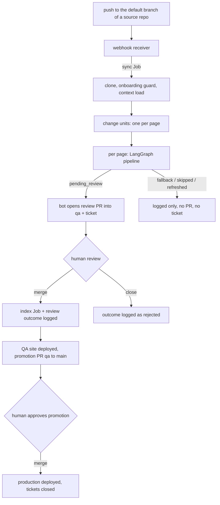

# End-to-end flow

Every step of one change, from `git push` to production, independent of the model tier. Each step says what happens, what it writes, and where to look when it goes wrong. Thresholds are the defaults in `multisync/config.py` (all overridable by environment variable).

## 0. One-time setup per source repo
| What | Where |
|---|---|
| Entry with `serviceName`, `targetPath`, `mode`, `trust`, `pages[]` (`path`, `kind`, `brief`, `scope`), `exclude`, optional `allowSensitive` | `config/repos.json` in the central repo, read from the **`qa`** branch |
| Link repos that share an API: `linkedRepos: ["owner/repo"]` (and optional `contract.role`, `crossRepoGate`) on ONE side of the pair | `config/repos.json`; see `docs/ONBOARD-A-REPO.md` |
| Repo allowed to start Jobs | `ALLOWED_REPOS` in `infra/k8s/webhook.yaml`, applied to the cluster |
| Push webhook to `https://rubenalejandrocalderoncorona.org/api/sync-webhook` (JSON, shared secret `multisync-webhook`) | Source repo settings |

## 1. Trigger (webhook receiver, `multisync/webhook.py`)
1. GitHub sends the event. The HMAC signature is checked; a bad one is rejected.
2. `push`: accepted only if the repo is in `ALLOWED_REPOS` and the ref is its **default branch**. A push whose `before` is 40 zeros (first push of a branch) sets `FULL_SYNC=1`.
3. The receiver creates a Kubernetes Job: `sync` (this one), `index` (merged review PR), `review` (review PR closed unmerged), `deploy` (docs site built), `revise` (reviewer requested changes, see step 6). The Job gets a 2 h deadline (`JOB_DEADLINE_SECONDS`, max 4 h) and is deleted 5 min after it ends.
- Not started: repo not allowed, wrong branch, ping, bad signature. Check the receiver log (`kubectl -n multirepo logs deploy/multisync-webhook`) and the GitHub webhook "Recent deliveries".

## 2. Job start (`scripts/job-entrypoint.sh`, mode `sync`)
1. **Preflight**: Qdrant and the FactStore (Postgres) must answer, else the Job fails here.
2. Tokens: `DOCS_SYNC_PAT` clones the repos; model keys come from `multisync-secrets`.
3. Clone the central repo and check out `qa`; clone the source repo at the pushed SHA.
4. Build the changed-docs list (docs-mode only; code-mode ignores it).

## 3. Context and guards (`multisync/cli/run_pipeline.py`)
1. **Site context**: the docs site itself is embedded (terminology, what other pages say). Failure only degrades context.
2. **Onboarding guard** (code mode): a file in scope that looks sensitive (secret-like path, "confidential" marker) blocks the repo. Nothing is embedded or sent to a model, every page falls back with `onboarding_blocked`. Fix: add to `exclude`, or acknowledge with `allowSensitive`.
3. **Code context load**: chunk the source files in the pages' scopes, embed them into the code collection in Qdrant, extract public symbols (routes, public classes, config keys) into the `symbols` table and `doc_refs`. Incremental by default, full on the first push or `FULL_SYNC`. Failure makes every code page fall back (`context sync failed`).
4. **Repo facts**: deterministic facts (language mix, build file, versions, route and config counts) plus README facts that must quote the source verbatim; each fact stores source path, hash and time. A README fact contradicting a deterministic fact is flagged.
5. **Change units**: docs mode, one per changed markdown file. Code mode, one per declared page whose scope contains a changed file (every page on a full sync).

## 4. Per page: the LangGraph pipeline (`multisync/pipeline.py`)
| # | Node | What it does | Ends the page with |
|---|---|---|---|
| 1 | prefilter | Diff smaller than 3 lines is not worth a draft unless forced. A removed source produces a delete decision. | `skipped` |
| 2 | cross_repo | Two kinds of contract point. Manual: the change mentions a symbol of the cross-repo registry, every repo owning that feature must have it. Automatic (`linkedRepos`): a route the change added or modified that a linked repo calls (`client_call` symbol, matched on the normalised path) needs that repo to have an approved document mentioning its call. Nobody calls the route: nothing to wait for. Provider side only; `crossRepoGate` off/warn/block (env `CROSS_REPO_GATE` wins). | `fallback: cross_repo_incomplete` |
| 3 | route | Free, no model: classify `internal` vs `public_interface` (changed public symbol, route, config key, registry hit, or symbol other docs mention) and pick the tier: cheap or expensive. | |
| 4 | similarity | Embed a hypothetical paragraph of what the docs would say, compare to the approved page. Similarity at least 0.92 means the page already says it. | `refreshed` (page re-keyed, no PR) |
| 5 | code_context, gar, semantic_context | Retrieve code and doc chunks (top 12 code chunks, 30 000 char budget, drop cosine below 0.45), generate the hypothetical answer, add related pages. | |
| 6 | write_draft | Draft with the chosen tier, the page brief, style, outline and facts. Incremental code runs, edited source docs whose site page exists (docs mode) and revisions after a review use **patch drafting** (below); a first draft of a page is written in full. The PR body shows the mode per page. | |
| 7 | verify_draft | Deterministic, no model: required symbols named, structure, front matter, and in patch mode the `patch_too_broad` drift guard. A cheap draft that fails is redone once on the expensive tier without using an attempt. | back to 6 |
| 8 | judge | Model judge scores precision (at least 0.9), recall (0.85), core recall (1.0), style (0.7), quality (0.75) and lists unsupported claims. Malformed JSON is retried once. | |
| 9 | polish_draft | If only style or grounded-wording tags failed, polish once instead of rewriting. | back to 8 |
| 10 | loop and widen | Up to 3 attempts; then one automatic retry with expanded retrieval (up to 6 attempts in total). | |
| 11 | publish | Add front matter (`source`, `commit`), change history, store the judged claims. Trust `review` gives `pending_review`; trust `auto` gives `published`. | `pending_review` / `published` |
| 12 | fallback | Loop did not converge (`iteration_cap_exceeded`) or any exception (`pipeline_error`, `onboarding_blocked`). Nothing is published. | `fallback` |

### Patch drafting (code mode, docs mode, revisions)
When the change unit has an existing page and the run is incremental (a previous snapshot exists: not a first draft, not `FULL_SYNC`/`FORCE_PAGES`), `write_draft` does not rewrite the page. `multisync/patching.py` splits the page (front matter and Change History removed) into sections by headings of level 1-4 (`#` inside fenced code is ignored; text before the first heading is the `(preamble)` section; ids are heading paths such as `Endpoints > Listings > GET /api/v1/listings`). The model (same tier as the router chose, prompt `prompts/patch-code.md`) sees the source diff, changed symbols, the sections, the fact sheet and plan, and returns strict JSON: `replace`, `insert_after`, `delete` operations on section ids. Code assembles the page: untouched sections stay byte-identical. The assembled page then goes through verify_draft and the judge exactly like a full draft; nothing else changes. Polish is skipped in patch mode (it would rewrite the whole page); judge feedback goes back to the patch call.
- **Docs mode** (`kind: docs`, a source repo's `docs/*.md` or README converted into a site page): an edited source doc whose site page already exists is patched too. The base is the current site page (found under the service folder, whichever subfolder it was filed in; front matter and Change History removed), the change is a unified diff of the **source document** before -> after, and the model (prompt `prompts/patch-docs.md`) maps it onto the converted page, keeping the site's structure and wording of untouched sections. Same operations, assembly, drift guard and fallback; a patched page keeps its location (the folder is not classified again). A **new** doc (no page yet) and a **deleted** doc behave as before. `PATCH_DOCS_MODE=0` turns this off.
- **Revisions** (`revise` Job): the change unit carries `revisionPatch`. The base is the page at the PR branch tip (human edits included) and the reviewer's comments (body, and inline comments with `file:line`) replace the source diff ("change only the sections they concern; leave everything else byte-identical"), using `patch-docs.md` for docs-mode pages and `patch-code.md` for code-mode pages. A malformed reply twice, an unknown id or a bad operation falls back to the full redraft with the comments as feedback (`patchFallback`). A comment about the whole page ("restructure", "rewrite the intro") may legitimately touch many sections, so the drift guard uses `REVISE_PATCH_MAX_SECTION_SHARE` (default `1.0`, i.e. the guard is off for revisions; lower it to re-enable). `PATCH_REVISIONS=0` turns revision patching off.
- **Fallback**: malformed JSON (retried once), an unknown section id, a bad operation or a missing heading line makes the node fall back to the full rewrite for the rest of the page; the node note has `patchFallback: true` and `patchError`.
- **Drift guard**: verify_draft reports `retainedPct` (share of the existing lines kept byte-identical). If replaced + deleted sections exceed `PATCH_MAX_CHANGED_SECTION_SHARE` (0.5) of the sections, the page has at least `PATCH_GUARD_MIN_SECTIONS` (4) sections and the source diff is at most `PATCH_SMALL_CHANGE_LINES` (20) lines, the draft fails with `patch_too_broad` and the reason goes back as feedback (cheap tier: the free redo on the expensive tier still applies).
- `PATCH_DRAFTING=0` turns it all off. Metrics on the decision (code, docs and revisions): `patchMode`, `sectionsChanged`, `sectionsTotal`, `retainedPct`, and `draftMode`, the line shown in the PR body table (`Draft mode` column, e.g. `patch (1 of 8 sections changed)` or `full draft (new source document)`; older bodies without the column are still read by the parser). The revision comment lists the mode per page. These knobs are in the thresholds, so `policy_version` changes when this ships.

Every decision, per-node log and cost is written to the FactStore (`decisions`, `node_logs`) and traced to Phoenix.

## 5. Publish and review PR (end of the entrypoint)
1. `published` pages (trust auto) are pushed straight to the target branch.
2. `pending_review` pages: branch `docs-sync/<repo-slug>-<sha7>`, one commit, force-pushed.
3. **Bot token**: the Job mints a GitHub App installation token (`BOT_APP_ID`, `BOT_APP_PRIVATE_KEY`) and pushes and opens the PR with it. If it cannot, it warns and uses the PAT; such a PR cannot be approved by its owner.
4. PR into `qa` with a table of judge scores. An existing PR for the same branch is edited, not duplicated.
5. **Supersede**: older open `docs-sync/<same repo>-*` PRs are closed only if every page they hold is also in the new PR, and are marked `<!-- multisync:superseded -->` so they are not logged as rejections.
6. **Ticket (cAImanDesk)**: opened or reused only here, for a draft waiting in QA; its link and marker go into the PR body. Fallbacks open **no** ticket (`TICKET_ON_FALLBACK=1` restores that); they appear in the Job summary and the FactStore.
7. If no page is `pending_review`, the Job prints "nothing needs review" and exits: no PR, no ticket.

## 6. Human review (QA)
The reviewer approves, edits (commits to the branch) or closes the PR. Branch protection needs one approval, and the bot is the author, so the reviewer can approve.

### Review feedback loop
A reviewer who submits **Request changes** on a bot-authored review PR gets a revision pushed to the same branch.
| Step | What happens |
|---|---|
| Webhook `pull_request_review`, `submitted`, `changes_requested` | Accepted only for an open `docs-sync/*` PR into `qa`, authored by the bot, from a non-bot owner, member or collaborator. Starts a `revise` Job named `multisync-revise-<PR>-<review id>` (a redelivery gets a 409 and starts nothing). |
| Guards (`revise_pr --plan`, from the GitHub API) | Skips if a `<!-- multisync:revised\|revise-failed\|revise-capped review=ID -->` comment exists for this review, the PR carries `<!-- multisync:superseded -->`, or 3 rounds were already used (then it comments that a human must edit). |
| Redraft | Source cloned at the commit named in the PR body; each page of the PR is revised by the normal pipeline in **patch mode** (see Patch drafting: the review body and inline comments are the change; full redraft with them as feedback if the patch fails), the page **as it is on the branch tip** (human edits included) as the base, the model tier stored with the original decision, and the same judge and deterministic gates. No re-indexing. |
| Push | Only if a page passed the gates: commit `docs: revise after review <id>` as the bot, plain `git push` (fast-forward only, never forced; a concurrent human push makes it fail and nothing is lost). |
| Comment | One bot comment `<!-- multisync:revised review=<id> -->` with per-page judge scores and what was not changed. If no page passes, `<!-- multisync:revise-failed ... -->` lists the failed checks and nothing is pushed. |
The bot never approves, dismisses or merges: the reviewer re-reviews. Nothing is written to `review_outcomes` by a revision; at merge the page differs from the first commit, so the existing logic records `draft_with_edition`. Setup: the central repo webhook must also tick **Pull request reviews**; the GitHub App needs no new permission (Pull requests: read and write).

## 7. Merge into `qa`
| Step | Who | Effect |
|---|---|---|
| Webhook `pull_request` closed, merged, head `docs-sync/*` | receiver | starts the `index` Job |
| `index` Job | cluster | embeds the merged pages as approved docs (replaces old chunks, deletes removed pages); then `record_review` |
| `record_review` | cluster | one `review_outcomes` row per page: `draft_with_noedition` (merged unchanged), `draft_with_edition` (merged edited), reviewer and time; 10 % of unchanged ones are sampled for a second-person audit. A page whose stored decision lacks classification, tier or policy version is skipped, never guessed. |
| Actions workflow `qa` job | GitHub | notes the ticket "deployed to QA"; opens or extends the rolling `qa` to `main` promotion PR (bot token once the Actions secrets exist) |
| `docs-site` workflow, then `workflow_run` webhook | GitHub, receiver | builds the image, starts a `deploy` Job that rolls out `docs-qa` |

A review PR closed **unmerged** starts a `review` Job: logs `draft_rejected` rows (unless superseded) and notes the ticket; nothing is indexed.

## 8. Promotion to production
A human approves and merges the promotion PR into `main`. The workflow closes every ticket named in it; the docs-site build and a `deploy` Job roll out `docs-prod`.

## 9. Metrics (read-only)
`multisync metrics review-readiness --segment CLASS:TIER` gives the Wilson lower bound of the no-edit rate (needs at least 30 reviews and a lower bound of 0.85). `audit-gap` compares audited accuracy to the raw no-edit rate. Nothing reads these to approve anything; `auto_approval_eligible` stays false.

## Where to look when something goes wrong
| Symptom | Likely cause | Look at |
|---|---|---|
| No Job after a push | repo not in `ALLOWED_REPOS`, not the default branch, bad signature | receiver log, GitHub webhook deliveries |
| Job fails at preflight | Qdrant or Postgres unreachable | Job log (kept 5 min) |
| Every page `onboarding_blocked` | sensitive-looking file in scope | `python -m multisync.cli.onboard_check` |
| Every page `pipeline_error` / context failed | embedding model or Qdrant error | `node_logs`, `python -m multisync.cli.runs` |
| Page `skipped` | diff under 3 lines | decision reason |
| Page `refreshed`, no PR | similarity 0.92 or more: docs already match | decision metrics `minChunkSimilarity` |
| `cross_repo_incomplete` | a registered feature is missing in one repo | decision reason lists the repo |
| `iteration_cap_exceeded` | judge never passed in 6 attempts | decision `attempts`, Phoenix trace |
| Job killed after 2 h | many pages, slow models | raise `JOB_DEADLINE_SECONDS` |
| PR authored by the owner | bot secrets missing or token failed | Job log line `WARNING: no bot token` |
| Old PRs stay open | supersede only closes subsets | PR file lists |
| Ticket missing | no `pending_review` page, or cAImanDesk unreachable | Job log step "review ticket" |
| No `review_outcomes` row | decision lacks labels, PR superseded, or webhook not delivered | `record_review` output in the index Job |
| "Request changes" does nothing | webhook lacks the "Pull request reviews" event, reviewer not owner/member/collaborator, PR not bot-authored, 3 rounds used | webhook deliveries, `kubectl -n multirepo get jobs` for `multisync-revise-*`, PR comments with `multisync:revise-*` markers |
| Revise Job ran, no push | no page passed the judge/deterministic gates (see the `revise-failed` comment), or a human pushed meanwhile (non fast-forward) | Job log, PR comment |
| `patch_too_broad` | model replaced most sections for a tiny source change | verify_draft note `reasons`, `retainedPct`; the writer is retried with the reason |
| `patchFallback: true` | patch reply was malformed twice, or named an unknown section (code, docs mode or revision) | write_draft note `patchError`; the page was fully rewritten (large diff in the PR); the PR table says `full draft (patch failed: ...)` |
| big diff on an edited doc page, `Draft mode` says `full draft (...)` | no existing page found for the source doc (renamed, ambiguous name, never published), `PATCH_DOCS_MODE=0`, or a full sync | the reason is in the PR table and in `metrics.draftMode` |
| Page not in QA after merge | `index` or `deploy` Job failed | `kubectl -n multirepo get jobs`, `docs-site` workflow run |

Job logs disappear 5 minutes after the Job ends: use `python -m multisync.cli.runs` (reads Postgres) or Phoenix at `/phoenix`.
