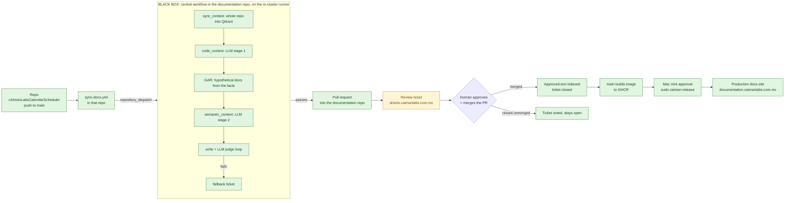

# Integrating a repository

Worked example: `cAImanLabs/cAImanLabsCalendarScheduler` into the production documentation site.

## 1. The flow

Your flow, with the pipeline as a black box in the middle. Green is built and tested, amber is built but needs your input, red is missing.

Everything in the black box and the ticket calls is built and tested. What is not in place yet is the wiring on your side (sections 3 to 5) and one decision about QA (section 7).

## 2. Where the documentation repos are

| | Production docs repo | Portfolio docs repo |
|---|---|---|
| GitHub | `cAImanLabs/cAImanLabs-Documentation` | `rubenalejandrocalderoncorona/caimanlabs-portfolio-docs` |
| On your machine | `/Users/racc/Documents/CodeProjects/cAImanLabs/cAImanLabs-Documentation` | `/Users/racc/Documents/CodeProjects/Portfolios-Demos/caimanlabs-portfolio-docs` |
| Site | `documentation.caimanlabs.com.mx` | not deployed yet |
| Production release | merge to `main`, image to GHCR, **Mac mini approval** (`sudo caiman-release`), K3s rollout | none yet |
| Use it for | cAImanLabs products (CalendarScheduler, portals, pipelines) | your personal portfolio projects |

CalendarScheduler is a cAImanLabs product, so its central repo is the **production documentation repo**. Its working copy is currently on branch `codex/documentation-mcp-macmini`; I did not touch it.

## 3. Add the action to the source repo (CalendarScheduler)

1. Copy [`examples/calendarscheduler/sync-docs.yml`](../examples/calendarscheduler/sync-docs.yml) to `.github/workflows/sync-docs.yml` in `cAImanLabsCalendarScheduler`. It is already set to `CENTRAL_REPO: cAImanLabs/cAImanLabs-Documentation`, `TARGET_BRANCH: main`, `SYNC_MODE: code`.
2. In that repo add the secret `DOCS_SYNC_PAT`: a fine-grained token with **resource owner = the `cAImanLabs` organization**, Contents + Pull requests + Workflows write on `cAImanLabs-Documentation`, and Contents read on `cAImanLabsCalendarScheduler`. (Both repos are in the same org, so one token works. For personal repos feeding the portfolio repo you need a second token owned by your user.)
3. Commit it to `main`. It dispatches on every push; the black box decides whether anything is worth documenting.

You do not need to add anything else to the source repo. It has no AI key and no knowledge of the pipeline.

## 4. Prepare the documentation repo (once)

1. Copy these workflows from this tool into `cAImanLabs-Documentation/.github/workflows/`: `sync-docs-central.yml`, `sync-docs-approved.yml`, `bootstrap-context.yml`.
2. Add the repo entry from [`examples/calendarscheduler/repos.entry.json`](../examples/calendarscheduler/repos.entry.json) to `config/repos.json` in that repo (create the file with `{ "defaults": {...}, "repos": { ... } }` if it does not exist; use `config/repos.json` in the portfolio repo as the shape). It declares three pages (overview, web-app architecture, data model) and excludes translations, migrations, the marketing site, the upstream `apps/docs` and agent files, so none of that is ever sent to a model.
3. Add the **Projects** group to the sidebar: see [`examples/documentation-sidebar.md`](../examples/documentation-sidebar.md). Without it the pages exist but never appear in the menu, because that repo's sidebar is hand-written.
4. Set the repo secrets and variables listed in [SETUP-REQUIRED.md](SETUP-REQUIRED.md) section 4. `TARGET_BRANCH` is `main` (set in the source workflow). The pipeline forces review whenever the target is `main`, so nothing is ever committed there directly; every change arrives as a pull request.
5. Register a runner for this repo. The in-cluster runner in `infra/k8s/runner.yaml` is registered to **one** repository. For this org repo either deploy a second Deployment with `REPO_URL` set to it, or switch to an organization-level runner (`RUNNER_SCOPE=org`, `ORG_NAME=cAImanLabs`, token with org runner administration).

## 5. First run

1. Run **Bootstrap Context** in the documentation repo with `source_repo = cAImanLabs/cAImanLabsCalendarScheduler`. The log ends with the number of code chunks and semantic chunks now in Qdrant. For a repo this size (about 1,600 files) expect a few thousand chunks and a few cents of embeddings.
2. Push any small change in CalendarScheduler (or run **Sync Documentation** manually with `full = true` to generate all three pages).
3. Watch the run: each node prints its result. A pull request opens in the documentation repo, and a ticket appears in cAImanDesk with a link to it.
4. Review and merge the PR. The ticket closes. The existing release path (image build, then the Mac mini approval) takes it to production.

## 6. Ticketing: facts you need to know

The ticket step works today over REST and is ready for the MCP. What I found:

| Fact | Detail |
|---|---|
| The MCP server is **not deployed** | The cluster has no `vikunja-mcp` pod, service or ingress, and no `vikunja` namespace. The URLs `https://mcp-vikunja.caimanlabs.com.mx/sse` and `http://vikunja-mcp:8000/sse` do not exist yet (the hostname does not resolve) |
| Its manifest does not match the cluster | Manifest: namespace `vikunja`, `VIKUNJA_URL=http://vikunja:3456/api/v1`, ingress class `nginx`. Cluster: tickets run as service `caiman-tickets` (port 80) in namespace `caimanlabs-operations`, ingress class `traefik` |
| **It has no authentication** | Anyone who can reach port 8000 can call `delete_project`, `delete_task` and the other 31 tools. The manifest also publishes it through an ingress. Do not expose it publicly. Keep it ClusterIP-only |
| It logs in with a shared user and password | The password has a default hardcoded in `mcp_server.py`. Prefer a Vikunja API token (`VIKUNJA_API_TOKEN`, which the server already supports) and rotate the default |
| Tested | My client was run against your real server code over real SSE (create, list, get and update tasks), with a fake Vikunja behind it |

To use the MCP: deploy it into `caimanlabs-operations` with `VIKUNJA_URL=http://caiman-tickets/api/v1` and a token, no ingress, then set on the documentation repo `CAIMANDESK_TRANSPORT=mcp` and `CAIMANDESK_MCP_URL=http://vikunja-mcp.caimanlabs-operations.svc.cluster.local:8000/sse` (reachable from the in-cluster runner). Until then, leave `CAIMANDESK_TRANSPORT` unset and provide `CAIMANDESK_API_TOKEN`; the behavior is identical.

Ticket lifecycle:

| Event | Ticket |
|---|---|
| A run fails (fallback) | `[docs-sync] <cause>: <repo> <page>` opened, or a note added if one is already open |
| A review PR opens | `[docs-review] <repo> @ <sha>` opened with the PR link and the judge scores; the PR body carries a hidden marker so the ticket can be found again |
| The PR is merged | note added, ticket closed |
| The PR is closed unmerged | note added, ticket stays open |

## 7. One decision still open: what "QA" is

Your production docs have no QA environment today: a PR is validated by CI, merging to `main` builds the image, and the Mac mini approval promotes it. So "PR in QA" can mean two different things:

| Option | What it is | Cost |
|---|---|---|
| **A. The PR is the QA stage** (what this guide assumes) | The review PR targets `main`. The ticket tracks it. Merge = approval. The existing Mac mini approval is the production gate | nothing new to build |
| **B. A real QA site** | PRs target a `qa` branch that deploys to its own site (for example `documentation-qa.caimanlabs.com.mx`); a second PR or an approval promotes `qa` to `main` | a second deployment and a promotion step |

Option A is what is built. Option B needs a second site and a decision on who promotes.
