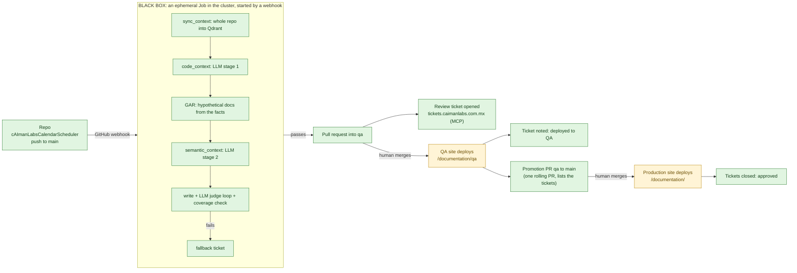

# Integrating a repository

Worked example: `cAImanLabs/cAImanLabsCalendarScheduler` into the documentation site at
`https://rubenalejandrocalderoncorona.org/documentation/` (production) and `/documentation/qa` (QA).

## 1. The flow

Everything is built and tested. The two sites are deployed (amber because the promotion workflows have not run on GitHub yet).

| Step | Who | What happens |
|---|---|---|
| 1. Push | developer | CalendarScheduler `main` gets a commit |
| 2. Black box | pipeline | drafts the pages, checks every claim against the code, checks completeness |
| 3. PR into `qa` | pipeline | one PR per run; a review ticket is opened with the PR link and the judge scores |
| 4. QA | reviewer | merges the PR; QA deploys at `/documentation/qa`; the ticket gets a note |
| 5. Promotion | pipeline | a single rolling PR `qa` to `main` lists everything waiting, with its tickets |
| 6. Production | you | merge the promotion PR; production deploys at `/documentation/`; tickets close |

A PR closed without merging leaves its ticket open with a note; nothing is indexed.

## 2. Where things are

| | |
|---|---|
| Central repo (this site) | `rubenalejandrocalderoncorona/multirepo-agent-docs`, local `/Users/racc/Documents/CodeProjects/Portfolios-Demos/multirepo-agent-docs` |
| Tool (pipeline code) | `rubenalejandrocalderoncorona/ai-multysinc-tool`, local `/Users/racc/Documents/CodeProjects/Portfolios-Demos/ai-multysinc-tool` |
| Source repo | `cAImanLabs/cAImanLabsCalendarScheduler`, local `/Users/racc/Documents/CodeProjects/cAImanLabs/cAImanLabs-CalendarScheduler` |
| Ticketing | `https://tickets.caimanlabs.com.mx` (Vikunja v2.5), MCP at `/api/v2/mcp` |
| Hosting | Traefik on the VPS k3s cluster, namespace `multirepo`, on the same host as the personal portfolio (path routing) |

`cAImanLabs/cAImanLabs-Documentation` (`documentation.caimanlabs.com.mx`, Mac mini release gate) is a separate, older site and is not part of this flow.

## 3. Add the action to the source repo

Preferred (no workflow in the source repo): add a **webhook** to the source repo, event "Pushes", payload URL
`https://rubenalejandrocalderoncorona.org/api/sync-webhook`, content type JSON, secret from the cluster (see [WEBHOOK-JOBS.md](WEBHOOK-JOBS.md)).
Add the repo to `ALLOWED_REPOS` in `infra/k8s/webhook.yaml`. The source repo needs no AI key, no secret and no workflow file.

Alternative: copy [`examples/calendarscheduler/sync-docs.yml`](../examples/calendarscheduler/sync-docs.yml), which dispatches to the central repo's manual fallback workflow
(it cannot reach Qdrant from GitHub-hosted runners).

The token the cluster Job uses to clone and open PRs is `DOCS_SYNC_PAT` in the `multisync-secrets` Secret: a **classic token** with `repo` and `workflow`, because the source is in the `cAImanLabs` organization and the central repo is under your user (a fine-grained token has one owner).

## 4. Prepare the central repo (once)

1. **Branches.** Create `qa` from `main`: `git push origin main:qa`. Protect both so only PRs change them.
2. **Config.** `config/repos.json` already lists CalendarScheduler (three pages, glossary pinning the product name, and the `docs` globs that load its existing user guide as semantic context). Change it by PR.
3. **Secrets and variables** on the repo (only the manual fallback workflows read them; the Jobs read the cluster Secret `multisync-secrets` and ConfigMap `multisync-config`) (full list in [SETUP-REQUIRED.md](SETUP-REQUIRED.md)): `DOCS_SYNC_PAT`, `AI_API_KEY`, `FACTSTORE_DATABASE_URL`, `CAIMANDESK_API_TOKEN`; variables `QDRANT_URL=http://qdrant.multirepo.svc.cluster.local:6333`, `CAIMANDESK_PROJECT_ID=10` (project "Multirepo-Syncs"); optional `DEEPSEEK_API_KEY` (cheap tier).
4. **The sites.** Apply `deploy/k8s.yaml` once (two Deployments, two Services, one Ingress with the two prefixes) and the tool's webhook manifests (`infra/k8s/webhook.yaml`, see [WEBHOOK-JOBS.md](WEBHOOK-JOBS.md)). Make the GHCR package public, or create the `ghcr-pull` secret described in `deploy/k8s.yaml`. Then set the variable `DEPLOY_ENABLED=true`.
5. **Webhook receiver.** Deploy `infra/k8s/webhook.yaml` and add the GitHub webhooks ([WEBHOOK-JOBS.md](WEBHOOK-JOBS.md)). There is no standing runner.

## 5. First run

1. Run **Bootstrap Context** for `cAImanLabs/cAImanLabsCalendarScheduler` (loads the whole repo and your docs site pages into Qdrant). Check what was loaded: `python -m multisync.cli.context_search --status`.
2. Run **Sync Documentation** manually with `full = true`, or push a change. Each node prints its result, and the job summary lists the context retrieved.
3. Merge the PR into `qa`: QA deploys. Merge the promotion PR: production deploys and the tickets close.

## 6. Ticketing

The ticket step uses **Vikunja's built-in MCP server** at `https://tickets.caimanlabs.com.mx/api/v2/mcp` (Streamable HTTP, Bearer API token). Inside the cluster the same server is `http://caiman-tickets.caimanlabs-operations.svc.cluster.local/api/v2/mcp`; set `CAIMANDESK_URL` to that and `CAIMANDESK_PUBLIC_URL` to the public address so links in tickets stay clickable.

| Setting | Value |
|---|---|
| `CAIMANDESK_API_TOKEN` | the Vikunja API token (secret) |
| `CAIMANDESK_PROJECT_ID` | the project that receives docs tickets (for example `3`, `cAImanLabs`) |
| `CAIMANDESK_TRANSPORT` | `mcp` (default) or `rest` |

Tools used: `tasks_create`, `tasks_read_all` (duplicate check), `tasks_comments_create`, `tasks_update`. This path was run against your real instance: create, find, comment, close, then delete the test task.

| Event | Ticket |
|---|---|
| A run fails | `[docs-sync] <cause>: <repo> <page>` opened, or a comment added if one is open |
| A review PR opens | `[docs-review] <repo> @ <sha>` opened with the PR link and judge scores |
| The PR is merged into QA | comment: deployed to QA (stays open) |
| The promotion PR is merged | comment, ticket closed |
| A PR is closed unmerged | comment (stays open) |

The Python MCP server in `/Users/racc/.gemini/antigravity/scratch/vikunja-mcp` is not deployed and is not needed. If you ever do deploy it: it has no authentication and exposes `delete_project`/`delete_task`, so keep it cluster-internal.
