# Onboarding a new repository

The path from "a repo exists" to "its documentation stays current and its code is searchable in the vector database".
Every step below has a check. Steps 1 and 2 cost nothing and call no model.

```mermaid
flowchart LR
  A["1. Add the repo to<br/>config/repos.json"] --> B["2. DRY RUN<br/>onboard_check.py<br/>(no network, no cost)"]
  B -->|"blockers"| A
  B -->|"clean"| C["3. Load the context<br/>Bootstrap Context<br/>(embeddings into Qdrant)"]
  C --> D["4. Verify what is loaded<br/>context_search.py --status / --query"]
  D --> E["5. First run for one page<br/>Sync Documentation, pages=..."]
  E --> F["6. Read the page against<br/>the source, tune scope and brief"]
  F --> G["7. Add sync-docs.yml<br/>to the repo"]
  G --> H["Every push: only changed<br/>files are re-embedded"]

  classDef free fill:#e1f5e1,stroke:#2e7d32;
  classDef cost fill:#fff4d6,stroke:#b8860b;
  class A,B,D free;
  class C,E cost;
```



## 1. Declare the repo

Add an entry to `config/repos.json` in the central repo (change it by pull request). Start from
[`examples/calendarscheduler/repos.entry.json`](../examples/calendarscheduler/repos.entry.json).

| Field | What it decides |
|---|---|
| `mode` | `docs` (sync the repo's own docs), `code` (write pages from the code), or `both` |
| `trust` | start with `review`. `auto` publishes without a human |
| `targetPath` | where the pages land, for example `src/content/docs/projects/<name>` |
| `pages[]` | one entry per page: `path`, `title`, `kind` (a style from `config/doc-styles.json`), `brief`, `scope` |
| `pages[].scope` | the files that page is **based on**. This is the most important setting: the model sees only these |
| `exclude` | globs that must never be read or embedded (fixtures, generated code, translations, anything restricted) |
| `docs` | globs of **existing documentation** to load as semantic context (an end-user docs app, CONTRIBUTING) |
| `glossary` | the product name, and upstream names that must never appear |

### Linking repositories that share an API (optional)

When this repo's HTTP API is called by another repo (a backend and its frontend), declare the link ONCE, on either side:

```json
"Fidavia/fidavia":          { "linkedRepos": ["Fidavia/fidavia-frontend"], "contract": { "role": "provider" } },
"Fidavia/fidavia-frontend": { "contract": { "role": "consumer" } }
```

| Field | Meaning |
|---|---|
| `linkedRepos` | up to 10 `owner/repo` strings. The link is symmetrical in meaning: if A lists B, the pair is linked even if B does not list A. Declare each pair once |
| `contract.role` | `provider`, `consumer` or `both` (default). A consumer-only repo never gates; a provider-only repo is never treated as a caller |
| `crossRepoGate` | `block` (default), `warn` (the draft continues, the warning is in `metrics.crossRepo.warning`) or `off`. Env `CROSS_REPO_GATE` overrides it |

How it decides, per change, with no model: a provider route that the change added or modified is a contract point when a linked repo has a
`client_call` for it (a literal API path in its code, for example `private static final String EVENT_VENUE_PATH = "/api/v1/events/{id}/venue"`;
`{id}`, `:id`, `<id>` and `${id}` all match the same segment). That consumer must then have an approved document that mentions its call, else the
page ends `cross_repo_incomplete` naming the awaited repo. A route nobody calls yet never blocks. The consumer repo must itself be onboarded with
its API client code inside some page `scope`, so its calls are extracted. Best practice: link only repos that share an API.
`config/feature-registry.json` stays as the manual override for features the extraction cannot see.
The dry run warns about unknown linked repos, bad roles and links declared on both sides.

Rules of thumb that came from real runs:
- A page about *everything in X* needs a scope that really contains X (Prisma models live in `prisma/models/*.prisma`, not in `schema.prisma`).
- One page per area. A page whose scope is far larger than the model's snapshot (about 60,000 characters) is built from a fraction of its files.
- Pick the style by what the reader needs; styles for schemas and configuration also turn on a deterministic completeness check.

## 2. Dry run (free)

```bash
python -m multisync.cli.onboard_check --repo owner/name --dir /path/to/checkout
```

It prints what would be loaded (code files and chunks, documentation files, what is excluded), an embedding cost estimate,
and for each page how many in-scope files fit the snapshot. **The blockers are enforced, not only advised.** Every run repeats this check before anything is embedded: a repository with a blocker is not sent to any model, every page falls back with a `onboarding_blocked` ticket, and nothing is published until the owner excludes the file or acknowledges it with `"allowSensitive": ["path"]` in the repo's entry (for example a README that only mentions the word "restricted" in an example).

It blocks on: no config entry, a page whose scope matches no
files, duplicate page paths, and files that look sensitive (secret-type paths, "restricted/confidential" markers in notes).
It warns about: missing briefs or glossary, `trust: auto`, an unknown style, files with secret-looking lines (those lines are
removed before embedding), and pages that cannot see most of their scope.

On CalendarScheduler it showed 507 code files (977 chunks), about 400,000 tokens (under one cent), and that a single
"web app" page would have been built from 24 of its 618 files. That is why the page was split.

## 3. Load the context (embeddings)

Run **Bootstrap Context** in the central repo with the source repo and a ref, or locally:

```bash
python -m multisync.cli.bootstrap_context --repo owner/name --dir /path/to/checkout --full \
  --site-dir /path/to/central-repo --site-repo owner/central-repo
```

This writes to two Qdrant collections:

| Collection | Holds | Used for |
|---|---|---|
| `code_context` | every in-scope source file, chunked, with its path and line range | stage 1: what the code does |
| `docs_chunks` | the repo's README, `docs/`, extra `docs` globs, the page briefs, and the central site's pages | stage 2: what the docs should say, terminology |

Secret-looking lines are scrubbed first. Re-running is safe: the repo's previous chunks are replaced.

## 4. Verify what is loaded

```bash
python -m multisync.cli.context_search --status
python -m multisync.cli.context_search --repo owner/name --query "how are polls created" --kind code
python -m multisync.cli.context_search --repo owner/name --gar "A paragraph the docs might contain." --kind semantic
```

Check that the counts match the dry run and that a few real queries return the right files.

## 5 and 6. First run, then read the result

Run **Sync Documentation** manually with `full = true` and `pages = <one page>`. Read the generated page against the source:
the job summary lists which files it was based on and which context it retrieved. If it is thin, fix the `scope`, `brief` or
`glossary` and run again; the context stays loaded.

## 7. Connect the repo

Copy [`examples/calendarscheduler/sync-docs.yml`](../examples/calendarscheduler/sync-docs.yml) to `.github/workflows/sync-docs.yml`
in the source repo, set `CENTRAL_REPO`, `TARGET_BRANCH` and `SYNC_MODE`, and add the `DOCS_SYNC_PAT` secret.

From then on every push runs the pipeline. The index follows the repo by itself: each run re-embeds only the files that changed,
removes deleted ones, and, if the index is ever out of step with the repo (a missed run, a rebuilt database), reloads everything.

## What you do not have to do

- Create collections or tables (created on first use).
- Re-run the bootstrap after normal pushes.
- Add the repo's docs by hand: the README and `docs/` are picked up automatically.
