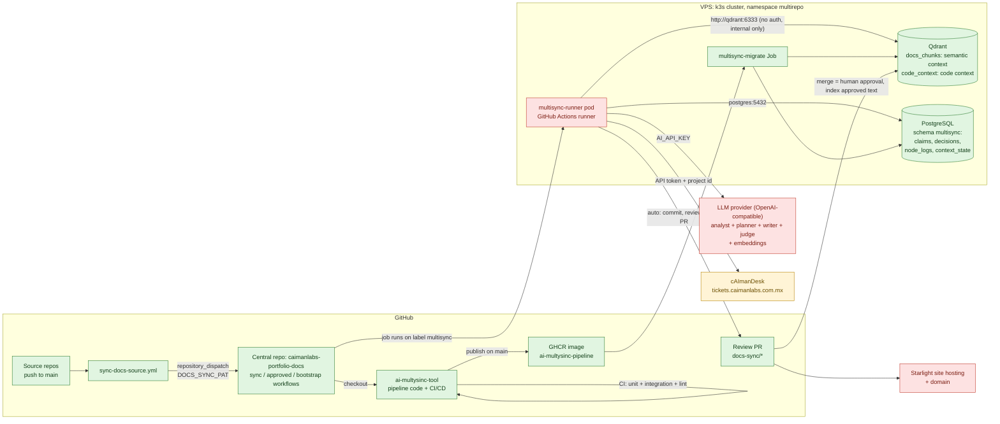
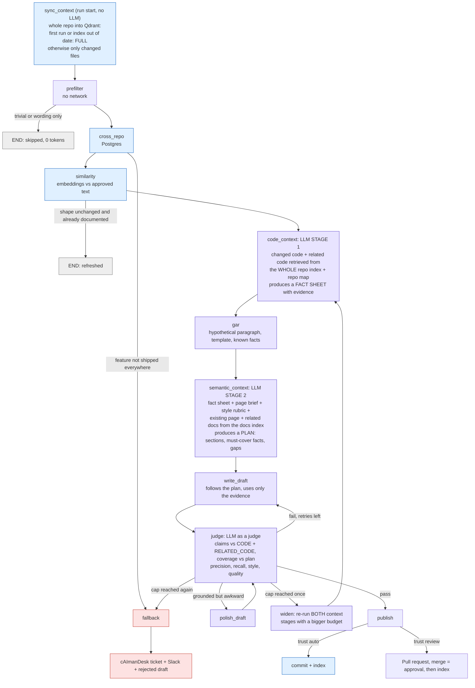

# What is in place, and what you still need to provide

Run `node scripts/doctor.js` at any time. It checks every item below (never printing a secret) and lists what is missing.

See [INTEGRATE-A-REPO.md](INTEGRATE-A-REPO.md) to connect a repository (worked example: CalendarScheduler into the production docs).

## 1. Status

| Area | Status | Evidence |
|---|---|---|
| Qdrant + PostgreSQL in the `multirepo` namespace (k3s on the VPS) | **Verified** | Integration suite (adapters + a full code-mode run with a scripted LLM) passes against both, through an SSH tunnel. It leaves no data behind; the app's schema `multisync` (4 tables) now exists |
| Pipeline code, both context stages, judge loop, fallback | **Verified** with a scripted LLM | 77 unit/CLI tests + 3 integration tests |
| **A real run** (OpenAI + the VPS Qdrant and Postgres, repo `rurag`) | **Done once, from a laptop** | Whole repo bootstrapped (13 files, 25 code + 14 semantic chunks); the sync ran every stage, looped once on a recall miss, and produced a page that was checked against the code. See section 7 |
| CI/CD workflow (`ci.yml`) | Written, lint-clean (`actionlint`), **not yet run on GitHub** | Opens with the first PR |
| In-cluster GitHub runner | **Missing**: manifest written, needs your token | `infra/k8s/runner.yaml` |
| LLM key (writer, judge, embeddings) | **Missing** | you provide |
| cAImanDesk token + project id | **Missing** (API contract verified) | you provide |
| GitHub secrets/variables on the central repo | **Missing** | section 4 |
| The same run inside GitHub Actions on the in-cluster runner | **Not done** | section 5 |

## 2. Infrastructure map

Red = missing, amber = exists but a credential is missing, green = exists and verified.

Qdrant has no authentication, so it must stay cluster-internal. That is why the runner lives inside the cluster instead of exposing it.

## 3. How one run works: two context stages

Before anything is analysed, the vector database must hold the whole repository. Then two separate LLM stages read it:
**stage 1 (code context)** establishes what is true from the code; **stage 2 (semantic context)** decides what the documentation should contain.

The two stages only run in `code` and `both` modes. In `docs` mode the source already is documentation, so they are skipped and cost nothing.
Every node writes a row to `multisync.node_logs` and a line to the runner log.

## 4. What you provide

### In the cluster (once)

| # | Item | How |
|---|---|---|
| 1 | Pipeline image | merge to `main`: CI publishes `ghcr.io/<you>/ai-multysinc-pipeline`. Make the package readable by the cluster or add a pull secret |
| 2 | Secret with the database URL | `kubectl -n multirepo create secret generic multisync-secrets --from-literal=FACTSTORE_DATABASE_URL='postgresql://<user>:<password>@postgres:5432/<database>'` (the values are in the existing `postgres-credentials` secret) |
| 3 | Secret for the runner | `kubectl -n multirepo create secret generic multisync-runner --from-literal=ACCESS_TOKEN=<fine-grained PAT, Administration: read/write on the central repo>` |
| 4 | Apply | run the **Deploy to cluster** workflow, or `kubectl kustomize infra/k8s \| sed "s#__PIPELINE_IMAGE__#<image>:<tag>#" \| kubectl apply -f -` |

### On the central repo `caimanlabs-portfolio-docs` (Settings > Secrets and variables > Actions)

| Kind | Name | Required | Value |
|---|---|---|---|
| secret | `DOCS_SYNC_PAT` | yes | fine-grained token: central repo (Contents, Pull requests, Workflows: write) + each source repo (Contents: read) |
| secret | `AI_API_KEY` | yes | your LLM provider key |
| secret | `FACTSTORE_DATABASE_URL` | yes | `postgresql://<user>:<password>@postgres:5432/<database>` (in-cluster name) |
| secret | `CAIMANDESK_API_TOKEN` | yes | cAImanDesk > Settings > API tokens (allow creating tasks and comments) |
| secret | `QDRANT_API_KEY` | no | only if you add auth to Qdrant later |
| secret | `SLACK_WEBHOOK_URL` | no | optional alerts |
| variable | `QDRANT_URL` | yes | `http://qdrant:6333` |
| variable | `RUNNER_LABEL` | yes | `multisync` (the in-cluster runner) |
| variable | `CAIMANDESK_PROJECT_ID` | yes | number in the cAImanDesk project URL |
| variable | `CAIMANDESK_TRANSPORT`, `CAIMANDESK_MCP_URL` | no | `mcp` plus the in-cluster SSE URL once the MCP server is deployed (see [INTEGRATE-A-REPO.md](INTEGRATE-A-REPO.md)); default is REST with the token |
| variable | `REVIEW_ENVIRONMENT_NAME` | no | label shown in review tickets, default `QA` |
| variable | `AI_API_BASE_URL`, `AI_MODEL`, `AI_FAST_MODEL`, `AI_EMBED_MODEL`, `AI_EMBED_DIM` | no | defaults: OpenAI, `gpt-4o`, `gpt-4o-mini`, `text-embedding-3-small`, `1536` (`AI_EMBED_DIM` must match the embedding model) |
| variable | `TOOL_REPO`, `TOOL_REF` | no | defaults: this repo, `main` |

For the deploy workflow, the `vps` Environment of the **tool** repo needs secrets `VPS_SSH_KEY`, `VPS_KNOWN_HOSTS` and variables `VPS_HOST`, `VPS_USER`.

### The judge

You provide the model. The writer, analyst, planner and judge all use the OpenAI-compatible endpoint above (`AI_MODEL`). The prompts are written: `prompts/judge-docs.md`, `prompts/judge-code.md`, `prompts/analyze-code.md`, `prompts/plan-docs.md`. To judge with a different, stronger model, ask for an `AI_JUDGE_MODEL` setting.

## 5. First successful run

1. Deploy to the cluster (table above) and run `node scripts/doctor.js` until clean.
2. In the central repo run **Bootstrap Context** for one project (for example `rubenalejandrocalderoncorona/raibis-lifeos`, mode `code`). Check the run log: the whole repo is now in Qdrant (`code chunks`, `semantic chunks`).
3. Copy `sync-docs-source.yml` into that project with `SYNC_MODE: 'code'`, push a small change, and watch the **Sync Documentation** run. Read each node line: similarity score, facts found, plan sections, judge scores.
4. Review the pull request it opens. Merging is the human approval that indexes the page.
5. To see the fallback path, set `PRECISION_MIN=1.01` as a repo variable for one run: the judge loop widens, escalates, and a ticket appears in cAImanDesk.

To rehearse steps 2 to 4 from your laptop first, open a tunnel (`ssh -L 16334:<qdrant ClusterIP>:6333 -L 15433:<postgres ClusterIP>:5432 vps`), export `QDRANT_URL`, `FACTSTORE_DATABASE_URL` and `INTERNAL_AI_API_KEY`, then run `node scripts/bootstrap_context.js --repo owner/name --dir <checkout>`.

## 6. Still to calibrate with real data

| Item | Default |
|---|---|
| `SIMILARITY_HIGH` | 0.92 (demo uses 0.85); read `minChunkSimilarity` in the logs |
| Judge thresholds | precision 0.90, recall 0.80, style 0.70, quality 0.75 |
| Context budget | 12 code chunks (30 widened), 30,000 characters |

## 7. What the first real run taught us (already fixed)

| Finding | Fix |
|---|---|
| OpenAI returned `429` (30k tokens/minute) mid-run and the whole run failed | The LLM client retries rate limits, 5xx and network errors, waiting as long as the server asks (`AI_MAX_RETRIES`, default 5) |
| The writer invented a Change History date (2023) | The table is generated by code from the real commit and date; any model-written one is removed |
| The page title was "Description" (a template heading) | Title comes from `pages[].title` or the service name; description from the plan's purpose |
| A page declared as `overview.md` was moved into `concepts/` | Code-mode pages keep their declared path |
| Dead `(#)` link, external links and a troubleshooting row not in the source | Prompt precedence (these rules beat the template) and the judge now treats every link, date and troubleshooting statement as a claim |
| The judge knew the page omitted the nine MCP tools but a 0.85 recall still passed | Facts are flagged `core`; any missing core fact fails (`CORE_RECALL_MIN=1`) and the writer is told exactly which |
| `sync_context` indexed files outside the page scopes (including restricted notes in `eval/fixtures`) | The index honors page `scope` and a repo-level `exclude`, with a test proving excluded files never reach the embedding call |

Known limit: one unsupported sentence in about 19 claims scores 0.947 and passes the 0.90 precision threshold. To forbid that, set `PRECISION_MIN=0.95` or higher.
