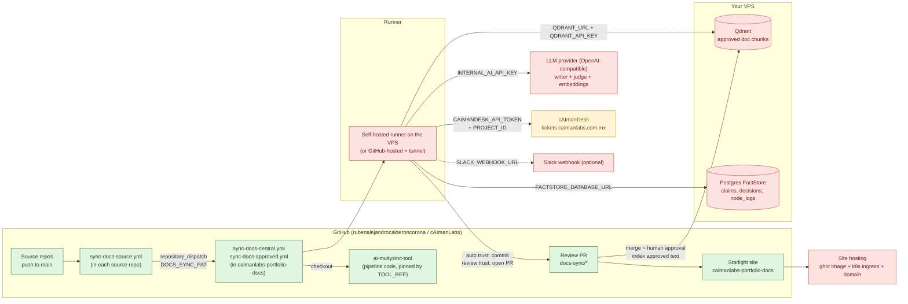
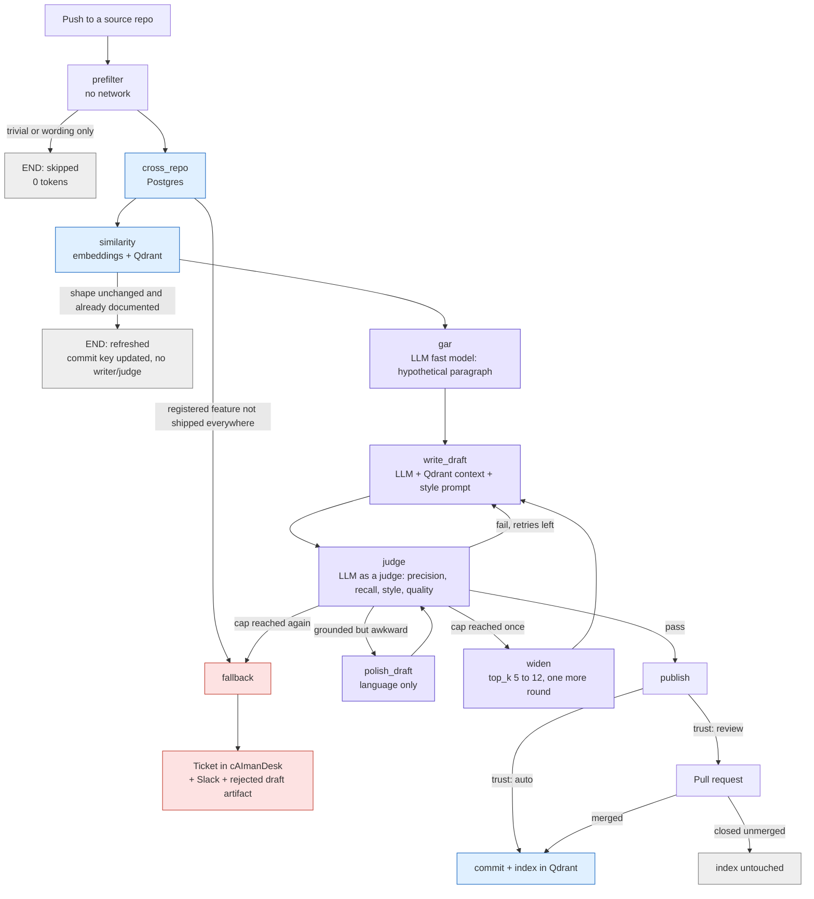

# What you need to provide

Everything below is outside the repository: credentials, endpoints and a few GitHub settings. Nothing here is stored in code.
Run `node scripts/doctor.js` at any time; it checks each item (never printing a secret) and tells you what is still missing.

## 1. Infrastructure map

Red items are what is **not yet provided or not yet verified**. Green items exist.

| Colour | Meaning |
|---|---|
| Red | Not provided yet, or code written but never run against the real service |
| Amber | The service exists and its API contract was verified; the token and project id are missing |
| Green | Exists in code / GitHub |

## 2. How one change flows (and which dependency each stage touches)

Every node writes one row to `node_logs` (Postgres) and one line to the runner log.

## 3. Credentials and endpoints you need to provide

### On the VPS (run once)

| # | Item | How |
|---|---|---|
| 1 | Docker + Compose on the VPS | install normally |
| 2 | `QDRANT_API_KEY`, `FACTSTORE_PASSWORD` | choose long random values; put in `.env` (copy `.env.example`) |
| 3 | Start the stack | `make stack-up`, then `make stack-check` |
| 4 | A way for CI to reach it | one of: a self-hosted GitHub runner on the VPS (recommended), WireGuard/Tailscale, or `--profile edge` for Qdrant over HTTPS (needs `QDRANT_DOMAIN`). Never publish Postgres |

### GitHub secrets and variables

Set these on **`caimanlabs-portfolio-docs`** (the central repo): Settings > Secrets and variables > Actions.

| Kind | Name | Required | Where to get it | Used by |
|---|---|---|---|---|
| secret | `DOCS_SYNC_PAT` | yes | GitHub > Settings > Developer settings > fine-grained token. Repos: the central repo (Contents, Pull requests, Workflows: write) and every source repo (Contents: read) | checkout of source repos, PR creation, issue fallback |
| secret | `AI_API_KEY` | yes | your LLM provider | writer, judge, embeddings |
| secret | `QDRANT_API_KEY` | yes | the value you chose in step 2 | vector store |
| secret | `FACTSTORE_DATABASE_URL` | yes | `postgres://factstore:<FACTSTORE_PASSWORD>@<host>:5432/factstore` | FactStore |
| secret | `CAIMANDESK_API_TOKEN` | yes | cAImanDesk > Settings > API tokens; allow creating tasks and comments | fallback tickets |
| secret | `SLACK_WEBHOOK_URL` | no | Slack incoming webhook | alerts |
| variable | `QDRANT_URL` | yes | e.g. `http://localhost:6333` on a VPS runner, or your HTTPS URL | vector store |
| variable | `CAIMANDESK_PROJECT_ID` | yes | number in the cAImanDesk project URL (`/projects/<id>`) | fallback tickets |
| variable | `RUNNER_LABEL` | if the runner is self-hosted | the label you gave the VPS runner | where jobs run |
| variable | `AI_API_BASE_URL`, `AI_MODEL`, `AI_FAST_MODEL`, `AI_EMBED_MODEL`, `AI_EMBED_DIM` | no | defaults: OpenAI, `gpt-4o`, `gpt-4o-mini`, `text-embedding-3-small`, `1536` | model choice. `AI_EMBED_DIM` must match the embedding model |
| variable | `TOOL_REPO`, `TOOL_REF` | no | defaults: `rubenalejandrocalderoncorona/ai-multysinc-tool`, `main` | pins the pipeline version |

In **each source repo**: secret `DOCS_SYNC_PAT` (a token that can dispatch to the central repo), and the copied `sync-docs-source.yml` with `CENTRAL_REPO`, `TARGET_BRANCH` and `SYNC_MODE` set.

### The judge

You said you will provide the judge. The pipeline only needs an OpenAI-compatible chat endpoint:

| Setting | Meaning |
|---|---|
| `AI_API_BASE_URL` + `AI_API_PATH` | endpoint (default `https://api.openai.com` + `/v1/chat/completions`) |
| `AI_MODEL` | the model used for the writer **and** the judge. To use a different, stronger model for judging only, tell me and I will add a `AI_JUDGE_MODEL` setting |
| prompts | already written: `prompts/judge-docs.md`, `prompts/judge-code.md` |

### Needed before the live demo can be called verified

| # | Item | Status |
|---|---|---|
| a | Qdrant and Postgres running on the VPS and reachable from the runner | not verified (the Docker daemon was off while building; the adapters are tested against fakes) |
| b | `similarity` threshold calibrated with real embeddings | default `0.85` is a guess; run the live demo and read `minChunkSimilarity` |
| c | judge thresholds calibrated on a few real pages | defaults `precision >= 0.90`, `recall >= 0.80`, `style >= 0.70`, `quality >= 0.75` |
| d | cAImanDesk token verified against the project | `node scripts/doctor.js` checks it |
| e | a domain and k8s ingress for the portfolio site | placeholders in `deploy/k8s.yaml` of the portfolio repo |

## 4. Order of operations

1. VPS: `make stack-up` and `make stack-check`.
2. Local: copy `.env.example` to `.env`, fill it, run `node scripts/doctor.js` until it is clean.
3. `npm run demo` (live) and read the similarity and judge numbers; adjust thresholds.
4. Set the GitHub secrets and variables above on the central repo.
5. Copy `sync-docs-source.yml` into one source repo, trigger it, watch the run.
