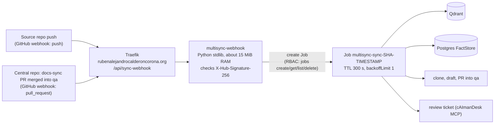

# Event-driven runs: webhook receiver and ephemeral Jobs

The standing GitHub Actions runner is retired. Nothing runs between events.



| Event | Handled when | Job mode | Result |
|---|---|---|---|
| `push` | repo is in `ALLOWED_REPOS`, branch is the default branch | `sync` | pipeline, PR into `qa`, ticket |
| `repository_dispatch` | repo is in `ALLOWED_REPOS` (`client_payload`: repository, sha, before, target_branch, changed_files) | `sync` | same |
| `pull_request` closed | central repo, merged, head `docs-sync/*`, base `qa` | `index` | approved pages embedded into Qdrant |
| `workflow_run` completed | central repo, workflow "Documentation site", success, event push, branch `qa` or `main` | `deploy` | the docs site image `ghcr.io/<central>:<env>-<sha12>` is rolled out to `docs-qa` / `docs-prod` |
| `ping` | any signed | none | `pong` |

A `push` whose `before` is all zeros (the push that creates the default branch, or a replayed first sync) starts the Job with `FULL_SYNC=1`, so every declared page is written, not only those touched by the last commit. The Job's deadline is `JOB_DEADLINE_SECONDS` (default 7200, at most 14400): pages run one after the other.

Anything unsigned or with a wrong signature gets `401`; a signed event that does not qualify gets `200 ignored: <why>`. All payload fields are
validated against strict patterns and reach the Job only as environment variables.

## Parts
- `multisync/webhook.py` receiver (standard library only, `pytest tests/test_webhook.py`).
- `scripts/job-entrypoint.sh` runs inside the Job: preflight (`healthcheck.py`: Qdrant and FactStore), clone, pipeline, PR, ticket. It needs `DOCS_SYNC_PAT`.
- `infra/k8s/webhook.yaml`: ServiceAccount `multisync-webhook-launcher`, Role (jobs create/get/list/delete in `multirepo` only), ConfigMap `multisync-config`, Deployment, Service, Ingress.
- One image, `multisync-pipeline` (`Dockerfile`: Python, git, gh, jq). The receiver runs `python -m multisync.webhook` from it and starts Jobs from it.

## Install
```bash
docker buildx build --platform linux/amd64 -t multisync-pipeline:local --load .
docker save multisync-pipeline:local | gzip | ssh vps "gunzip | sudo -n k3s ctr images import -"
ssh vps 'sudo -n kubectl -n multirepo create secret generic multisync-webhook --from-literal=WEBHOOK_SECRET="$(openssl rand -hex 32)"'
sed 's#__PIPELINE_IMAGE__#multisync-pipeline:local#' infra/k8s/webhook.yaml | ssh vps "sudo -n kubectl apply -f -"
```
Add `DOCS_SYNC_PAT` (classic PAT, `repo` + `workflow`) to `multisync-secrets`:
`kubectl -n multirepo patch secret multisync-secrets --type merge -p '{"stringData":{"DOCS_SYNC_PAT":"..."}}'`.

## Connect GitHub
Read the shared secret once: `ssh vps "sudo -n kubectl -n multirepo get secret multisync-webhook -o jsonpath='{.data.WEBHOOK_SECRET}' | base64 -d"`.
Then add a webhook (Settings, Webhooks) with payload URL `https://rubenalejandrocalderoncorona.org/api/sync-webhook`, content type `application/json`, that secret:
- on each source repo (for example `cAImanLabs/cAImanLabsCalendarScheduler`): event **Pushes**;
- on `rubenalejandrocalderoncorona/multirepo-agent-docs`: events **Pull requests** and **Workflow runs**.

Add further source repos to `ALLOWED_REPOS` in `infra/k8s/webhook.yaml`.

## Test by hand
```bash
B='{"ref":"refs/heads/main","before":"<sha>","after":"<sha>","repository":{"full_name":"cAImanLabs/cAImanLabsCalendarScheduler","default_branch":"main"},"commits":[]}'
SIG=sha256=$(printf '%s' "$B" | openssl dgst -sha256 -hmac "$SECRET" | awk '{print $NF}')
curl -i -X POST https://rubenalejandrocalderoncorona.org/api/sync-webhook -H 'X-GitHub-Event: push' -H "X-Hub-Signature-256: $SIG" -d "$B"
ssh vps 'sudo -n kubectl -n multirepo get jobs; sudo -n kubectl -n multirepo logs job/<name>'
```

## What moved off the runner
- `sync-docs-central.yml` is now a manual fallback (it cannot reach the cluster from GitHub-hosted runners).
- The `index` job of `sync-docs-approved.yml` is replaced by the `index` Job; the ticket and promotion jobs need only HTTPS and stay on GitHub-hosted runners.
- `docs-site.yml` no longer deploys: GitHub builds and pushes the image, then its `workflow_run` webhook starts a `deploy` Job (`multisync/cli/deploy_site.py`) under the `multisync-docs-deployer` service account, which can patch only `docs-qa` and `docs-prod`. No SSH key to the VPS exists anywhere. The cluster pulls the private GHCR image with the `ghcr-pull` secret.
