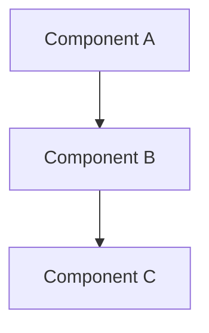

# [Technical Concept Template]

This is the reusable template for documenting technical concepts and architectural explanations.

## 1. Description

A brief, one-to-two sentence summary of what the concept is.

## 2. Core Problem

Describe the problem this concept is designed to solve. What challenge does it address?

## 3. How it Works

Explain the mechanics of the concept. Use diagrams, flowcharts, or bullet points to describe the process or workflow.

## 4. Key Components

### High-Level Diagram

### Core Components

- **Component A**: Description of what Component A does.
- **Component B**: Description of what Component B does.
- **Component C**: Description of what Component C does.

## 5. Architectural Deep Dive

### Security Model

Detail the system's approach to security, including authentication, authorization, and data protection.

### Scalability and Performance

Explain how the system is designed to handle growth and maintain performance under load.

### Monitoring and Observability

Describe how the system's health and behavior are monitored.

### Reliability and Disaster Recovery

Outline the strategy for ensuring high availability and recovering from failures.

## 6. References & Resources

- Link to related product documentation.
- Link to other relevant technical concepts.

## 7. Change History

| Date | Version | Author | Change Description | Completeness |
|------|---------|--------|--------------------|--------------|
| YYYY-MM-DD | 1.0 | [Author] | Initial creation | Fully filled |
